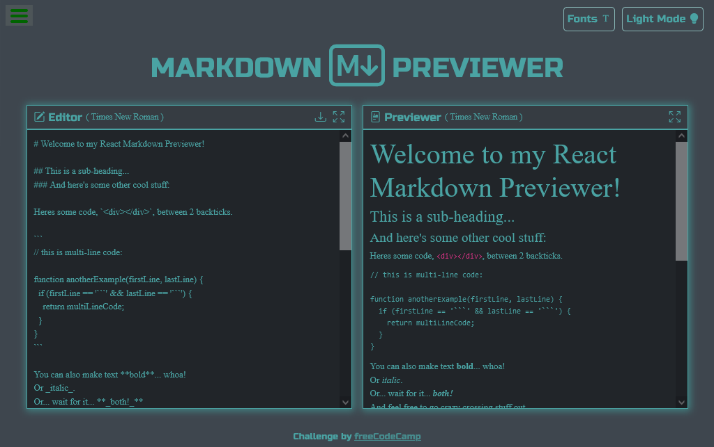

# freeCodeCamp - Markdown Previewer solution

This is a solution to the [Markdown Previewer challenge on freeCodeCamp](https://www.freecodecamp.org/learn/front-end-development-libraries/front-end-development-libraries-projects/build-a-markdown-previewer).

## Table of contents

- [Overview](#overview)
  - [The challenge](#the-challenge)
  - [Screenshot](#screenshot)
  - [Links](#links)
- [My process](#my-process)
  - [Built with](#built-with)
- [Author](#author)

## Overview

### The challenge

Users should be able to:

This project is part of the freeCodeCamp Front End Development Libraries certification. It involves building a Markdown previewer using HTML, CSS, Sass, JavaScript, React, Redux Toolkit, and Bootstrap. The application consists of an Editor where you can write Markdown code and a Previewer that displays a live preview of the rendered Markdown. This functionality is achieved using the marked library. To enhance the styling, Bootstrap icons are incorporated. The app includes a button to toggle between dark and light mode, as well as another button to switch between various fonts. The states of these functionalities are managed using Redux Toolkit. Additionally, there are buttons to expand the Editor and the Previewer to full screen, and a button to download the content of the Editor as a Markdown file (.md).

### Screenshot

### Links

- Solution URL: [GitHub](https://github.com/SFCC5555/markdown-previewer)
- Live Site URL: [MarkDown Previewer](https://sfcc-markdown-previewer.netlify.app/)

## My process

### Built with

- Semantic HTML5 markup
- CSS custom properties
- Flexbox
- Mobile-first workflow
- JavaScript
- Bootstrap
- Sass
- [React](https://reactjs.org/) - JS library
- Redux

## Author

- Website - [Fernando Carrasco Portfolio](https://sfcc5555.netlify.app/)